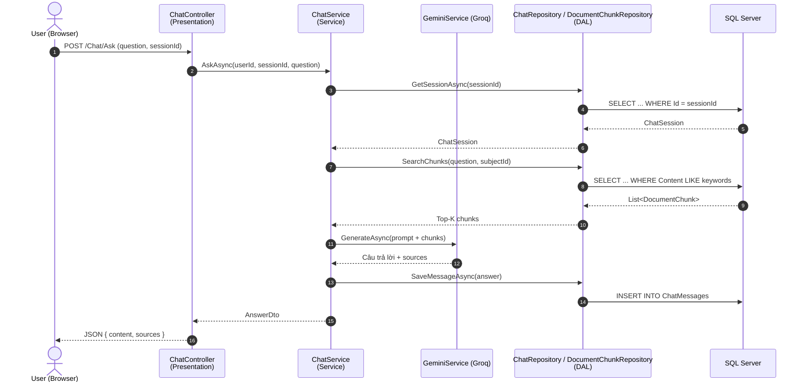

# Kiến trúc MVC 3-Layer — ChatBotPRN222

> ASP.NET Core MVC 8.0 · SQL Server (EF Core) · Groq AI · Cookie Authentication

## 1. Sơ đồ tổng quan

```mermaid
flowchart TB
    Client["🌐 Trình duyệt người dùng<br/><sub>HTTP Request / Response · Cookie session</sub>"]

    subgraph PRES["① PRESENTATION LAYER — ChatBotPRN222 (ASP.NET Core MVC)"]
        direction LR
        Controllers["📂 Controllers<br/>Home · Auth · Chat<br/>Document · User · Profile"]
        Views["🎨 Views (Razor .cshtml)<br/>Auth · Chat · Document<br/>Home · User · Profile · Shared"]
        VM["📦 ViewModels<br/>AuthVM · ChatVM<br/>ProfileVM · ErrorVM"]
        Prog["⚙️ Program.cs<br/>DI · Cookie Auth<br/>Authorization Policies<br/>Session · Routing"]
    end

    subgraph SVC["② SERVICE LAYER (Business Logic) — ServiceLayer.csproj"]
        direction LR
        AuthSvc["🔐 Auth &amp; User<br/>IAuthService · IUserService<br/>BCrypt hashing"]
        ChatSvc["🤖 Chat &amp; AI<br/>IChatService<br/>IGeminiService → Groq (RAG)"]
        DocSvc["📄 Document Pipeline<br/>IDocumentService<br/>ITextExtractor · IChunker<br/>ISubjectService"]
        Dtos["📋 DTOs &amp; Settings<br/>LoginResult · RegisterResult<br/>GroqSettings"]
    end

    subgraph DAL["③ DATA ACCESS LAYER — DataAccessLayer.csproj"]
        direction LR
        Entities["🧬 Entities (POCO)<br/>User · Subject · Document<br/>DocumentChunk · ChatSession<br/>ChatMessage"]
        Repos["🗄️ Repositories<br/>IUserRepository<br/>ISubjectRepository<br/>IDocumentRepository<br/>IDocumentChunkRepository<br/>IChatRepository"]
        Ctx["🔌 Context<br/>AppDbContext<br/>EF Core · SqlServer Provider"]
        Const["🏷️ Constants<br/>Roles: Admin · Lecturer · Student"]
    end

    Mongo[("🗄️ SQL Server<br/>Relational DB")]
    Gemini["✨ Groq AI API<br/>llama-3.3-70b-versatile"]
    Files[("💾 File Storage<br/>wwwroot/uploads")]

    Client -->|HTTPS| Controllers
    Controllers --> Views
    Controllers --> VM
    Views --> VM

    Controllers -->|gọi Interface (DI)| AuthSvc
    Controllers -->|gọi Interface (DI)| ChatSvc
    Controllers -->|gọi Interface (DI)| DocSvc

    AuthSvc -->|gọi IRepository| Repos
    ChatSvc -->|gọi IRepository| Repos
    DocSvc -->|gọi IRepository| Repos
    ChatSvc -.HTTPS.-> Gemini
    DocSvc --> Files

    Repos --> Entities
    Repos --> Ctx
    Ctx -->|EF Core DbContext| Mongo

    classDef pres fill:#eef2ff,stroke:#6366f1,color:#312e81
    classDef svc  fill:#ecfeff,stroke:#0891b2,color:#0e7490
    classDef dal  fill:#f0fdf4,stroke:#16a34a,color:#14532d
    classDef ext  fill:#fff7ed,stroke:#f59e0b,color:#b45309

    class Controllers,Views,VM,Prog pres
    class AuthSvc,ChatSvc,DocSvc,Dtos svc
    class Entities,Repos,Ctx,Const dal
    class Mongo,Gemini,Files ext
```

## 2. Luồng request điển hình (Sequence)



## 3. Quy tắc phụ thuộc giữa các layer

| Layer | Tham chiếu được phép | Tuyệt đối KHÔNG |
|---|---|---|
| **Presentation** | ServiceLayer · DataAccessLayer (chỉ Entities, Constants) | Gọi trực tiếp SQL Server / Groq API |
| **Service** | DataAccessLayer (Interfaces, Entities, Constants) | Tham chiếu ngược lại Presentation |
| **Data Access** | (không tham chiếu layer nào) | Phụ thuộc Service/Presentation |

**Nguyên tắc:** mũi tên phụ thuộc luôn đi **từ trên xuống dưới** thông qua **Interface (Dependency Injection)** — đảm bảo loose coupling và dễ unit test.

## 4. Bảng các Project (.csproj)

| Project | Vai trò | Thư mục chính |
|---|---|---|
| `ChatBotPRN222.csproj` | Presentation | `Controllers/`, `Views/`, `Models/`, `wwwroot/`, `Program.cs` |
| `ServiceLayer.csproj` | Business Logic | `Services/`, `Dtos/`, `Settings/` |
| `DataAccessLayer.csproj` | Data Access | `Entities/`, `Repositories/`, `Context/`, `Constants/`, `Settings/` |

## 5. Công nghệ & thư viện chính

- **ASP.NET Core MVC 8.0** — routing, controllers, Razor views
- **EF Core + Microsoft.EntityFrameworkCore.SqlServer** — kết nối SQL Server
- **BCrypt.Net-Next** — mã hoá mật khẩu
- **HttpClient + Groq REST** — gọi LLM `llama-3.3-70b-versatile`
- **Cookie Authentication** — đăng nhập, claim `NameIdentifier`, `Role`, `FullName`, `AvatarPath`
- **Bootstrap 5 + Bootstrap Icons** — UI
- **DOMPurify + marked.js** — render Markdown an toàn cho câu trả lời AI
